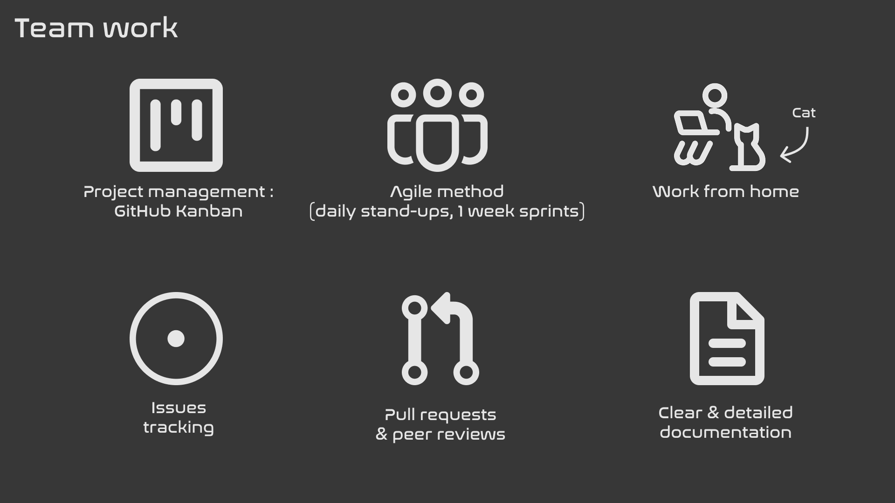

# BuddyCount

BuddyCount is a mobile app that helps you track your expenses and split them with your friends.

This file documents the architecture of the project, the requirements and the useful stuff to know about the project.

## Table of contents
- [API](#api)
- [Architecture](#architecture)
- [Requirements](#requirements)
- [Team work](#team-work)
- [Deploying locally](#deploying-locally)

## API

The API is documented using Swagger. It is available at [api.buddycount.duckdns.org/swagger](https://api.buddycount.duckdns.org/swagger).

## Architecture

The architecture is documented in [architecture.md](docs/architecture.md).

## Requirements

The requirements are documented in [requirements.md](docs/requirements.md).

## Team work

We are a (nearly) fully remote team. We work using a classic Agile methodology. We track the work to be done on a [GitHub Project](https://github.com/orgs/BuddyCount/projects/1/views/1). We aspire to have a clear documenation for anyone to board easily. See more in [CONTRIBUTING.md](./docs/CONTRIBUTING.md).

## Deploying locally

You can deploy BuddyCount locally. You will need to have Flutter, Docker and Node.js installed. Then follow the instructions in each repository :

- [frontend](https://github.com/BuddyCount/frontend)
- [buddycount-api](https://github.com/BuddyCount/buddycount-api)
- [deploy-infra](https://github.com/BuddyCount/deploy-infra) (only used to deploy in production)