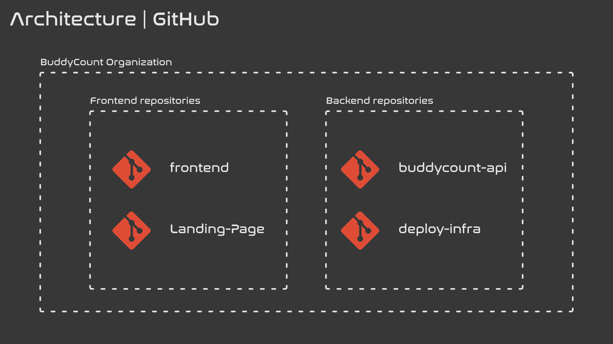
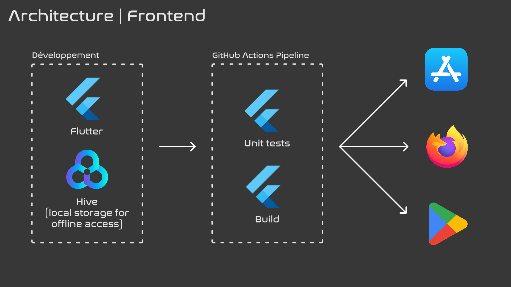
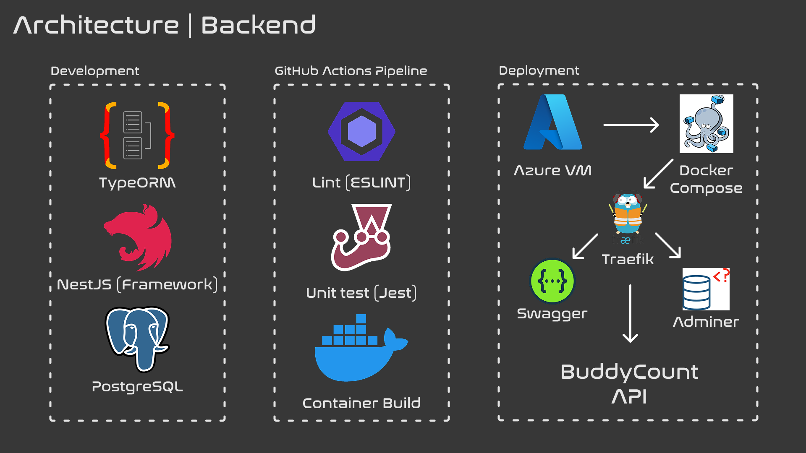
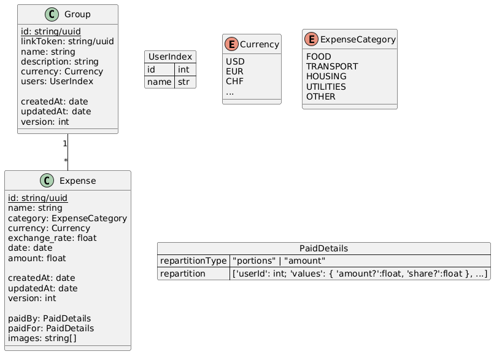

# BuddyCount architecture

This is a brief description of the architecture of the BuddyCount project.

## Table of contents

- [GitHub Organisation](#github-organisation)
- [Frontend stack](#frontend-stack)
- [Backend stack](#backend-stack)
- [Deployments](#deployments)
- [Database](#database)

## GitHub Organisation

All of BuddyCount's repositories are in the [BuddyCount](https://github.com/BuddyCount) GitHub organisation. Here's the structure of the organisation's main repositories:

## Frontend stack

We chose to use Flutter as our frontend framework. It is a multi-platform framework that allows us to build for iOS, Android and Web using a single codebase. This is also what we used to build the landing page. To make BuddyCount functional offline, we used a NoSQL database: Hive.  
Here are the repositories:

- [frontend](https://github.com/BuddyCount/frontend)
- [landing-page](https://github.com/BuddyCount/landing-page) (live at [buddycount.github.io/Landing-Page/](https://buddycount.github.io/Landing-Page/))

We used GitHub Actions to run the unit tests and build the frontend.
This schema illustrates the architecture of the frontend:

## Backend stack

The main backend repository is [buddycount-api](https://github.com/BuddyCount/buddycount-api). It is written in NestJS, using TypeORM and PostgreSQL.

The backend Docker image is built in a GitHub Actions workflow (which also run unit tests, verify code formatting and check linting), and is pushed to the [GitHub Container Registry](https://github.com/BuddyCount/buddycount-api/pkgs/container/buddycount-api).

We used Swagger to document the API (see [README.md](../README.md#api)), and adminer to manage the database in development.

Here's an overview of the backend architecture:

## Deployments

We deploy BuddyCount on an Azure VM. We use DuckDNS to get a domain name for the VM. We use Traefik as a reverse proxy to route the requests to the correct services. 

Traefik, PostGreSQL, adminer and our actual API are all deployed in containers and orchestrated using Docker Compose.

Learn more on the deploy-infra repository (private): [deploy-infra](https://github.com/BuddyCount/deploy-infra).

## Database

As mentioned earlier, BuddyCount uses a PostgreSQL database. The database schema is pretty simple. It is documented in [database/databaseumlER.puml](../database/databaseumlER.puml) and here is the resulting diagram:

It is then implemented directly in Typescript using TypeORM's entities.